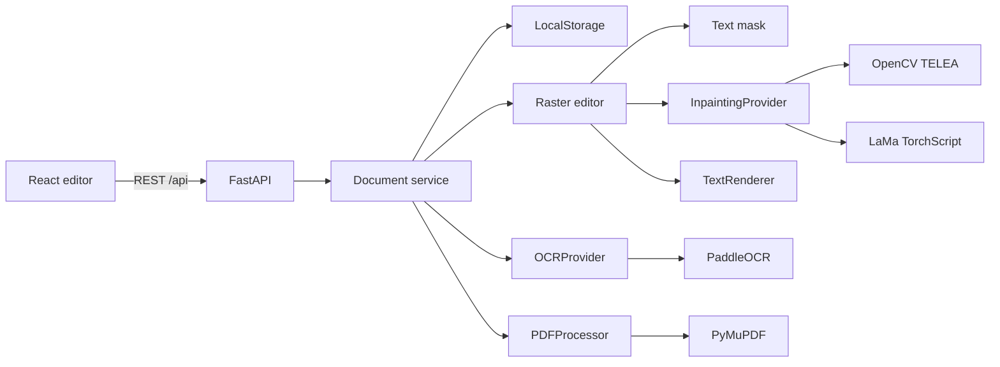
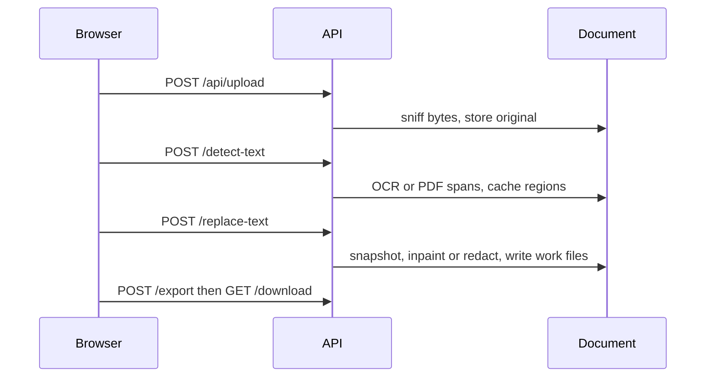

# Architecture

Local ReWords is a Vite frontend and a FastAPI backend. Files and models stay on disk.



## Components

- `frontend/` — upload, page stage, region list, history, export.
- `backend/app/api` — HTTP and error shape.
- `backend/app/services/document_service.py` — upload, detect, history, previews, export.
- `backend/app/ocr` — `OCRProvider`, Paddle adapter, normalizer.
- `backend/app/pdf` — `PDFProcessor`, PyMuPDF.
- `backend/app/image` — masks, style estimates, raster replacement.
- `backend/app/inpainting` — `InpaintingProvider`, OpenCV, LaMa, auto selector.
- `backend/app/rendering` — `TextRenderer` and the font library.
- `backend/app/storage` — `StorageProvider`, local directories.
- `backend/app/inference_lane.py` — one thread for Paddle and LaMa.

## Data flow



Normalized region:

```json
{"page":0,"text":"Welcome to Paris","bbox":{"x":120,"y":80,"width":400,"height":60},"confidence":0.98,"rotation":0,"source":"ocr"}
```

`source` is `ocr` or `pdf_text`. Coordinates for the viewer are pixels of the preview image. Native PDF regions also keep `pdf_bbox` in PDF points.

## Image edit

Original pixels → detection quad → stroke mask (not a filled box when the strokes are separable) → complexity score → OpenCV or LaMa → antialiased text warped into the quad → PNG work file.

Style (size, weight, color, spacing, alignment, opacity, and a shadow or outline when one is present) is measured from the region. Characters that do not change are copied from the original line. New characters are page letters repainted to that line's ink and blur. Otherwise the closest bundled face is drawn, and only if it clears the match bar. The new render is compared with the original line and adjusted for up to five passes.

## PDF

Per page:

- `native` — extract spans. Replacement redacts that span and inserts text. Preview is a render of the edited PDF. Export copies the page.
- `scanned` — render at the page's pixel scale (default 144 DPI, capped at 2400 px on the long side), OCR, edit the bitmap, export that bitmap into a page of the original size.
- Mixed documents use both. Unedited pages are not re-encoded as images.

## Models

PaddleOCR and LaMa load once. Calls go through the inference lane so a request thread never touches a model that was initialized elsewhere. OCR results and page renders are cached on the document. A new edit bumps that page's version and drops only that page's preview cache.

## API

| Method | Path | Role |
| --- | --- | --- |
| GET | `/api/health` | Devices and whether LaMa's file checks out |
| POST | `/api/upload` | Store a file |
| POST | `/api/ocr` | Detect, body `{document_id}` |
| GET | `/api/document/{id}` | State |
| POST | `/api/document/{id}/detect-text` | Detect |
| POST | `/api/document/{id}/replace-text` | Edit |
| POST | `/api/document/{id}/undo` `/redo` `/reset` | History |
| GET | `/api/document/{id}/pages/{n}/image` | Preview |
| GET | `/api/document/{id}/pages/{n}/thumbnail` | Thumbnail |
| POST | `/api/document/{id}/preview` | URL list |
| POST | `/api/document/{id}/export` | Build the download |
| GET | `/api/document/{id}/download` | File |
| GET | `/api/metrics` | In-process timings |

Errors are `{"error":{"code","message","detail"}}`.

## Storage

```
storage/{doc_id}/
  original.*          never modified
  work.pdf            PDF working copy
  pages/              image working copy
  original_pages/     image before edits
  overrides/          scanned pages that were edited
  cache/              renders and thumbnails
  snapshots/          undo history
  exports/            last export
  meta.json
```

## Errors

`AppError` codes include `UNSUPPORTED_FILE_TYPE`, `FILE_TOO_LARGE`, `CORRUPTED_PDF`, `CORRUPTED_IMAGE`, `PDF_ENCRYPTED`, `TOO_MANY_PAGES`, `NO_TEXT_DETECTED`, `OCR_FAILURE`, `INVALID_REPLACEMENT_TEXT`, `MISSING_FONTS`, `INPAINT_FAILED`, `EXPORT_FAILED`, `EXPORT_FORMAT`, `NOTHING_TO_UNDO`. LaMa failure during an edit does not use a hard error; the response uses fast mode and `fallback_reason`.
